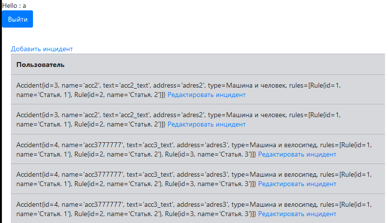
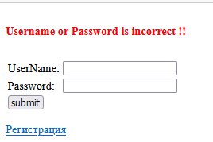
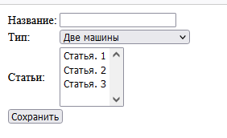
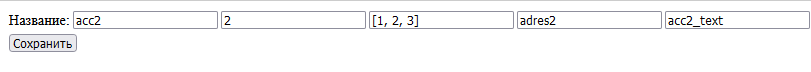

В блоке Spring разрабатывался проект - Автонарушители.

В системе существуют две роли. Обычные пользователи и автоинспекторы.
Пользователь добавляет описание автонарушение.
В заявлении указывает: адрес, номер машины, описание нарушения.
У заявки есть статус. Принята. Отклонена. Завершена.

Проект писался для ознакомления с принципами работы Spring.
На данном этапе проект требует доработки, как визуальной части(frontend), 
так и функциональной(хранение фотографий, назначение ролей USER, ADMIN пользователям).

В проекте используется связка Spring, Spring Security, Hibernate, PostgreSQL.

Вид системы. 
Главная страница - это таблица.

Перед входом на главную страницу пользователь должен пройти регистрацию и авторизацию.

Есть возможность добавлять инциденты и редактировать их.

